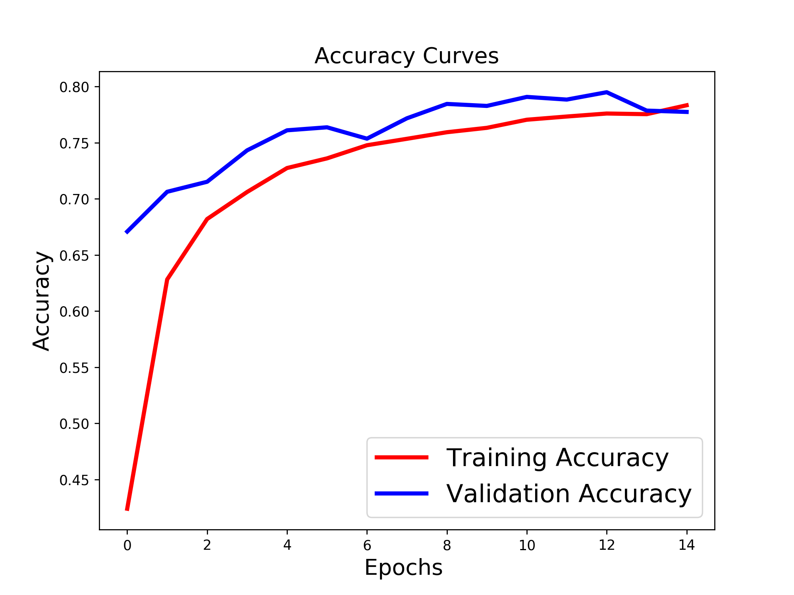
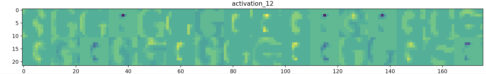

# Case-Study-Not-Mnist

In 2011 Yaroslav Bulatov made the notMNIST dataset. There are still 10 classes, but instead of numbers 0 - 9 you are classifying letters A - J of many different font styles.

__data:__ 28x28 pixel images of letters in all variations of font

### steps:
__split data__ in to train and validation sets (80/20)

__basic model:__ get a basic KERAS sequential CNN model to run
 - convert to greyscale for computational performance (already b/w)
 -  no image transformations ... they are already hard enough
 - initial performance: 75% accuracy on unseen test data
 - curious: validation accuracy > training accuracy

__optimize model:__

 | epochs    | batch size | optimization |  activation | dropout |  training accuracy | test accuracy |
 |----------|----------|---------|--------|------|----|----|
 | 15 | 200 | sgd | RelU | 0.5 | 0.661 |
 | 15 | 200 | adadelta | ReLU |0.5 | 0.787 |
 | 15 | 200 | adagrad | ReLU | 0.5 |0.786 |
 | 15 | 200 | adam | ReLU | 0.5 |0.791  |
 | 15 | 200 | nadam |  ReLU |0.5 | 0.807 |
 | 15 | 200 | nadam | sigmoid | 0.5 |0.642 |
 | 15 | 200 | nadam | sigmoid | 0.5 |0.755 |
 | 30 | 200 | nadam | ReLU | 0.1 |0.755 | 0.725 |
 | 30 | 200 | nadam | ReLU | 0.1 |0.761 | 0.779 |
 | 30 | 200 | nadam | ReLU | 0.9 |0.880 | 0.879 |

 best Conv2D params: kernal:(3,3), strides:(1,1), padding:'same'

## Visualizing CNN layers

1. Talk about what you planned to accomplish
- Construct a Convolutional Neural Net which would classify as many correct images as possible.
2. How you organized yourselves as a team
- Drew: CNN Mastermind
- Erin: Optimization Extraordinaire
- Mike: Ace in the Hole
- Sean: Made pictures of the letter G
3. What architecture you chose and why
4. What final architecture you chose and why (how did you pick your hyperparameters?)
5. How measured your model's performance
- Test Accuracy
6. Things learned along the way.
